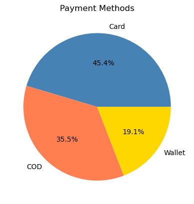
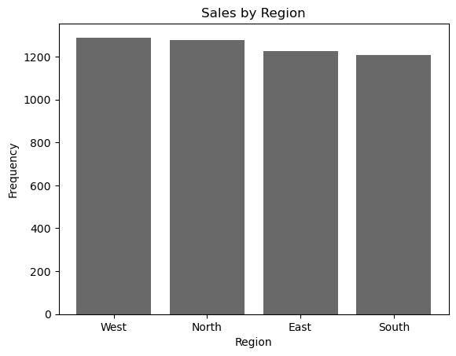
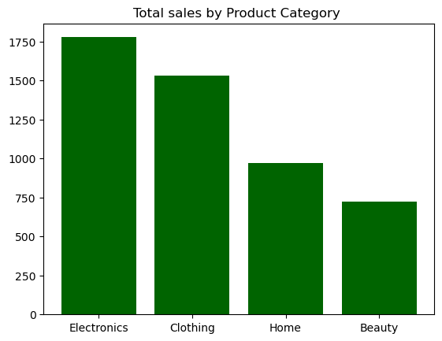
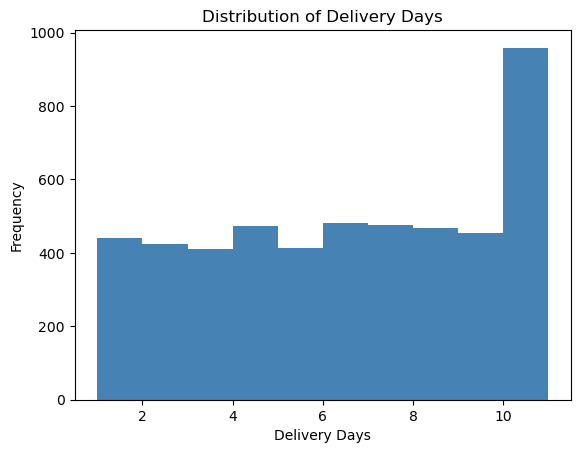
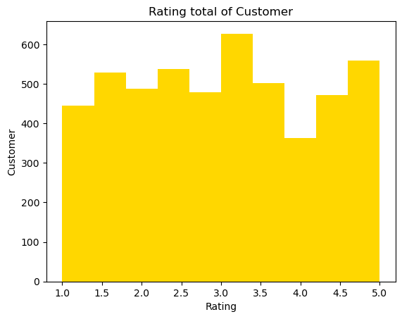
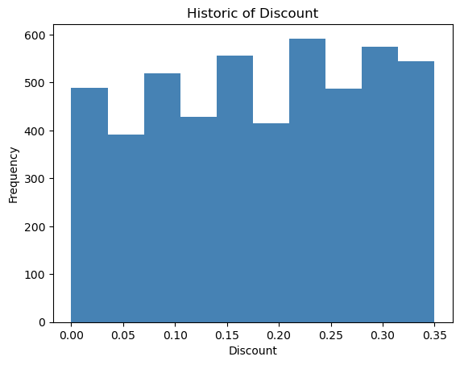
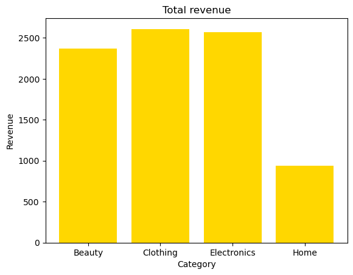
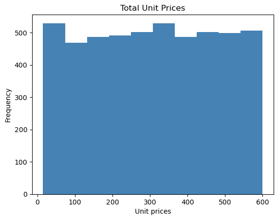
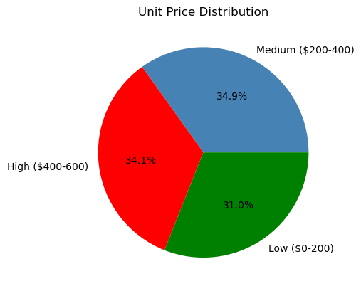

# 🛒 E-commerce Sales Analytics

## 📌 About the Project
Exploratory data analysis of e-commerce sales with 5,000 orders placed between 2022 and 2025.

## 🔍 Analysis Steps
- Exploratory analysis
- General statistics
- Data types analysis
- Distribution analysis
- Filters and selections
- NumPy analysis
- Visualization with Matplotlib

## 💡 Key Findings
- Dataset with more than **5,000 orders** — no null values or duplicates
- **Electronics** is the most sold category with **1,777 orders**
- Most expensive product: **Electronics — $599.96**
- Cheapest product: **Clothing — $15.15**
- Total revenue: **$5,109,775.74**
- Average delivery time: **6.12 business days**
- Average customer rating: **2.97 out of 5.0**
- Average discount applied: **17.99%**

## 📊 Charts

- Unique values per numeric column

- Payment methods

- Sales by region

- Total sales by product category

- Distribution of delivery days

- Customer rating

- Discount history

- Total revenue by category

- Unique prices

- Price distribution by range
  - High: $400 - $600
  - Medium: $200 - $400
  - Low: $0 - $200

## 🛠️ Technologies
- Python
- Pandas
- NumPy
- Matplotlib

## 👨‍💻 Author
Victor Gabriel Peixe

💼 LinkedIn: https://www.linkedin.com/in/victorgabrielpeixe/

📧 Email: victorgabrielpeixe2002@gmail.com